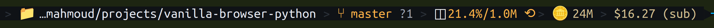
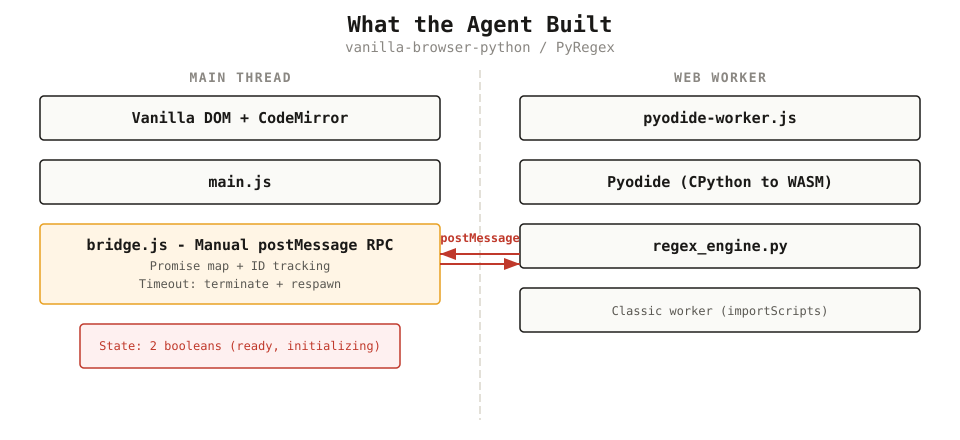
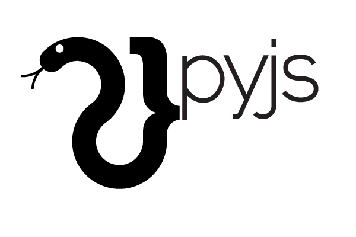
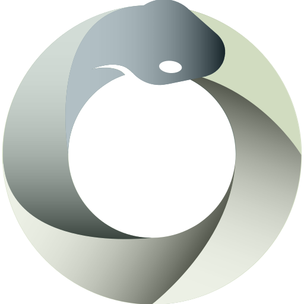
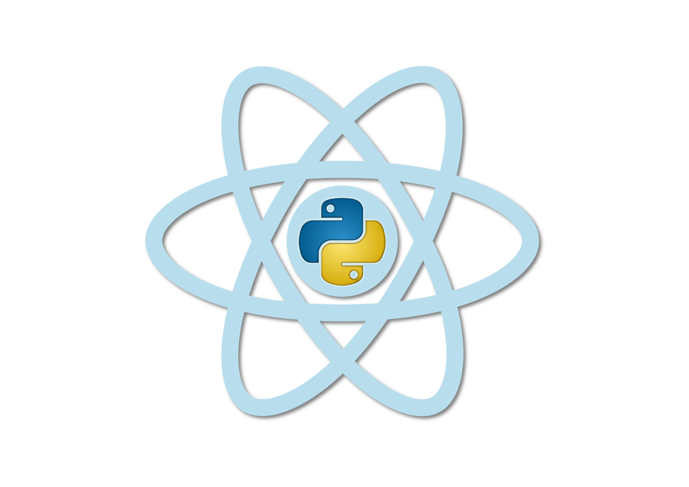
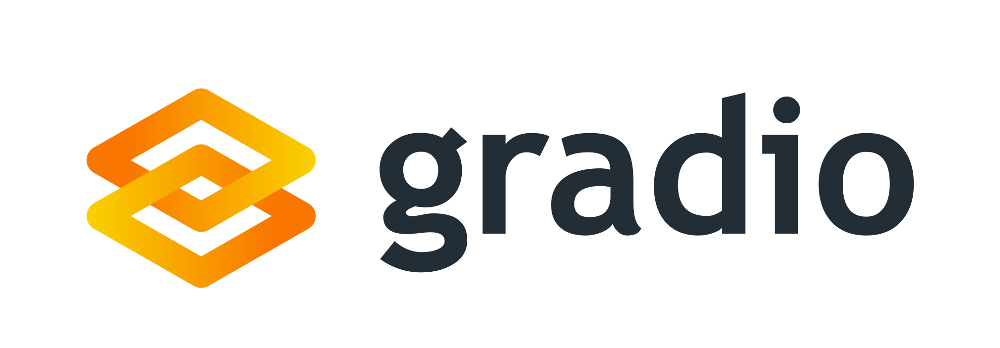
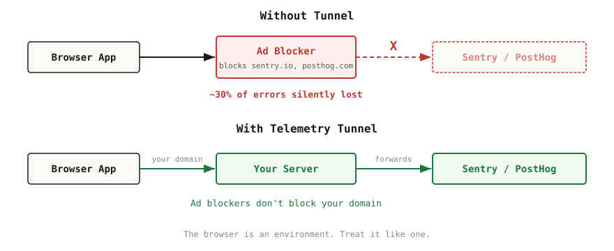
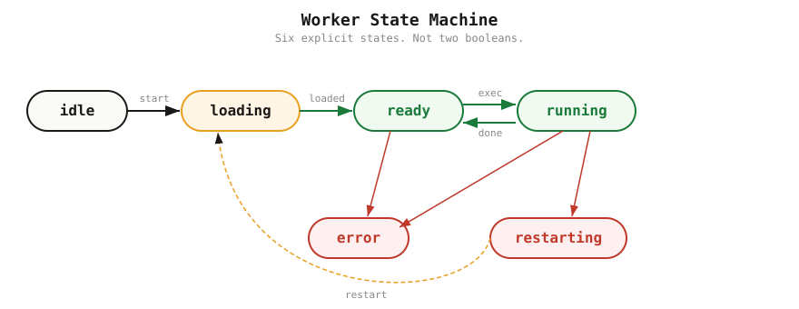
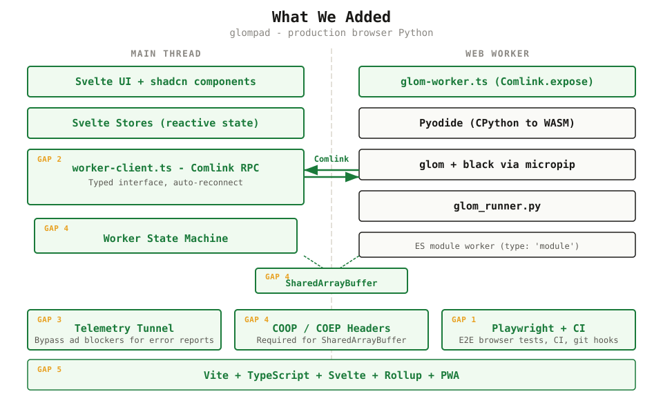

## A deep dive on <br><b>hand-building</b> <br>a browser Python app,<br> <b>byte by byte</b> {.bigword-reflect}


## JK {.bigword}

## {.prompt-display}

::: {.prompt-text}
/plan i'd like to have a "python-in-browser" setup that lets me test regexes using python's re module, for regex testing with python's regex specifically. research and propose the best architecture for this in 2026. apply the color scheme #FDA500 for accent, #3FABCC for action (light) and #3F8BA3 for action (darker, for like hover). We want a dark mode, so invert and convert as necessary.
:::

## One prompt.<br/>One plan.<br/>\$16 in tokens. {.bigword-reflect}

{.nostretch width="100%" style="margin-top: 20px;"}

## `yak.party/pyregex` {.iframe-demo background-color="#f8fafc"}

<iframe src="https://yak.party/pyregex" width="1840" height="880" scrolling="no" style="border: none; border-radius: 8px; display: block; margin: 0 auto; overflow: hidden;"></iframe>


## What Just Happened? {background-color="#f8fafc"}

{width="100%" style="display: block; margin: 0 auto;"}
<!--=========================================================-->
<!-- SECTION 2: "TALK OVER?" PIVOT (3:00-4:30)                -->
<!--=========================================================-->

## Talk over? {.bigword}

Have I been replaced by AI?


## 😂 {.bigword}

Agents don't give you the most important parts.


## This Talk {auto-animate="true"}



<div style="margin-top: 48px; display: grid; grid-template-columns: 1fr 1fr; gap: 0 80px; max-width: 1500px;">
<div style="padding: 28px 0; border-top: 2px solid #1a1917; display: grid; grid-template-columns: 90px 1fr;">
<div class="eyebrow" style="color: #e8a020;">01</div>
<div>
<div style="font-family: 'Fraunces', Georgia, serif; font-size: 40px; line-height: 1.1;">The WHY</div>
<div style="color: #8a8782; font-size: 0.62em; margin-top: 8px;">Neither syntax nor dogma.</div>
</div>
</div>
<div style="padding: 28px 0; border-top: 2px solid #1a1917; display: grid; grid-template-columns: 90px 1fr;">
<div class="eyebrow" style="color: #e8a020;">02</div>
<div>
<div style="font-family: 'Fraunces', Georgia, serif; font-size: 40px; line-height: 1.1;">The History</div>
<div style="color: #8a8782; font-size: 0.62em; margin-top: 8px;">A decade of attempts. What changed.</div>
</div>
</div>
<div style="padding: 28px 0; border-top: 1px solid #e3e0d8; display: grid; grid-template-columns: 90px 1fr;">
<div class="eyebrow" style="color: #e8a020;">03</div>
<div>
<div style="font-family: 'Fraunces', Georgia, serif; font-size: 40px; line-height: 1.1;">Five Gaps</div>
<div style="color: #8a8782; font-size: 0.62em; margin-top: 8px;">What the agent doesn't know about production.</div>
</div>
</div>
<div style="padding: 28px 0; border-top: 1px solid #e3e0d8; display: grid; grid-template-columns: 90px 1fr;">
<div class="eyebrow" style="color: #e8a020;">04</div>
<div>
<div style="font-family: 'Fraunces', Georgia, serif; font-size: 40px; line-height: 1.1;">The Future</div>
<div style="color: #8a8782; font-size: 0.62em; margin-top: 8px;">A glimpse at what's coming.</div>
</div>
</div>
<div style="padding: 28px 0; border-top: 1px solid #e3e0d8; display: grid; grid-template-columns: 90px 1fr;">
<div class="eyebrow" style="color: #e8a020;">05</div>
<div>
<div style="font-family: 'Fraunces', Georgia, serif; font-size: 40px; line-height: 1.1;">Reflections</div>
<div style="color: #8a8782; font-size: 0.62em; margin-top: 8px;">What this all adds up to.</div>
</div>
</div>
</div>

<!--=========================================================-->
<!-- SECTION 3: WHY (4:30-7:30)                               -->
<!--=========================================================-->

##



## {.scribble-slide .scribble-clean auto-animate="true" auto-animate-easing="ease-out" auto-animate-duration="0.4"}

<div class="scribble-block" data-id="b1">
<div class="scribble-head" data-id="h1">Python is awesome!</div>
<div class="scribble-sub fragment" data-id="s1">(and JavaScript is terrible)</div>
</div>


## {.scribble-slide auto-animate="true" auto-animate-easing="ease-out" auto-animate-duration="0.4"}

<div class="scribble-block" data-id="b1">
<div class="scribble-note">syntax isn't a reason</div>
<div class="scribble-head struck" data-id="h1">Python is awesome!</div>
<div class="scribble-sub struck" data-id="s1">(and JavaScript is terrible)</div>
<div class="scribble-note">and neither is dogma or aesthetics</div>
</div>

## Why Browser Python?





Actually good reasons:

:::: {.incremental}
- **Budget** - free compute on every device
- **Sandboxing + Security** - no server compromise
- **Reproducibility** - same results, client-side
- **Python is Awesome!!** - The *ecosystem*
::::
<!--=========================================================-->
<!-- SECTION 4: HISTORY - 2 SLIDES (7:30-11:00)               -->
<!--=========================================================-->

##



## The Graveyard {.graveyard}



::::: {style="font-size: 0.85em;"}

| Years | Project | Approach |
|-------|---------|----------|
| 2009-2015 | {height="1.2em" style="vertical-align: middle;"} **PyJS / Pyjamas** | Transpiler + Qt/GTK widgets |
| 2010-2021 | {height="1.2em" style="vertical-align: middle;"} **Silverlight / IronPython** | Browser plugin |
| 2013-2019 | {height="1.2em" style="vertical-align: middle;"} **PyPy.js** | Compile PyPy to JS |
| 2013-2021 | **RapydScript** | Python-like to JS compiler |
:::::


## Still Kicking {.graveyard}

::::: {style="font-size: 0.85em;"}

| Years | Project | Approach |
|-------|---------|----------|
| 2009-present | {height="1.2em" style="vertical-align: middle;"} | JS reimplementation, still chasing Python 3 |
| 2014-present | {height="1.2em" style="vertical-align: middle;"} | Runtime transpiler, maintained (Python 3.14), no C extensions |
| 2016-present | {height="1.2em" style="vertical-align: middle;"} **Transcrypt** | Python-to-JS transpiler, active (v3.9.4) |

:::::

Alive, but still niche.

## What Was Missing?

:::: {.columns}

:::: {.column width="72%"}

Every previous attempt lacked at least one of:

:::: {.incremental}
1. Python **syntax**
2. Python **stdlib**
3. Python **ecosystem** (`pip install`)
4. **DOM** access
5. **Bidirectional** JavaScript interop
::::

::::

:::: {.column width="28%"}

{width="100%" style="margin-top: 40px;"}

::::

::::

## Then: WebAssembly + Pyodide {auto-animate="true"}

:::: {.columns}

:::: {.column width="72%"}

::: {.fragment}
**2011** - Empythoned (Replit {height="1.4em" style="vertical-align: middle;"}): Emscripten + CPython.
:::

::: {.fragment}
**2017** - WebAssembly ships in all four browsers (overtaking Emscripten in Google Search results)
:::

::: {.fragment}
**2019** - Pyodide: CPython compiled to WASM (Mozilla Research)
:::

::: {.fragment}
**2020** - micropip: `pip install` in the browser (Pyodide 0.15)
:::

::: {.fragment}
**2026** - v0.29. CPython Tier 3 WASM support (PEP 816)
:::

::::

:::: {.column width="28%"}

{width="80%" style="margin-top: 40px;"}
::::

::::


## Built on {height="1.5em" style="vertical-align: sub; margin-bottom: -0.35em;"}  {.glory}

<div style="margin-bottom: 24px;"></div>
:::: {style="font-size: 0.78em;"}

| Project | What | Link |
|---------|------|------|
| {height="1.2em" style="vertical-align: middle;"} **JupyterLite** | Full Jupyter in browser (official subproject, Feb 2026) | [jupyterlite.readthedocs.io](https://jupyterlite.readthedocs.io) |
| {height="1.2em" style="vertical-align: middle;"} **Marimo** | Reactive notebooks, WASM export | [marimo.io](https://marimo.io) |
| {height="1.2em" style="vertical-align: middle;"} **Gradio-Lite** | ML demos in browser (Hugging Face) | [huggingface.co](https://huggingface.co/blog/gradio-lite) |
| {height="1.2em" style="vertical-align: middle;"} **Stlite** | Streamlit → WASM, PWA, Electron | [github.com/whitphx/stlite](https://github.com/whitphx/stlite) |

::::

. . .

Common thread: Mostly directly about **Python** in the user's browser.
<!--=========================================================-->
<!-- SECTION 6: FIVE GAPS (14:00-20:00)                      -->
<!--=========================================================-->

##



## Production Python in the browser {.gap-slide}

A couple projects I've shipped.

::::: {.columns}

::::: {.column width="50%"}

{height="1.4em" style="vertical-align: middle;"} **glompad**: <a href="https://yak.party/glompad">yak.party/glompad</a>

Side project: Data exploration with [glom](https://github.com/mahmoud/glom)

:::::

::::: {.column .fragment width="50%"}

{height="1.4em" style="vertical-align: middle;"} **FinFam**: <a href="https://finfam.app">finfam.app</a>

Work: Like GitHub for consumer finance.

:::::

:::::

::: {.aside-box .fragment}
[NB]{.aside-label} "Python" isn't the point, it's just the best tool for this job.
:::

## What the Agent Built {.gap-slide}

The architecture

{width="100%" style="display: block; margin: 0 auto;"}

## What's Missing? {.gap-slide}



Five gaps to close

::: {.gap-list .incremental}
- [1]{.gap-num} **Testing** [Playwright, CI, and git hooks]{.gap-sub}
- [2]{.gap-num} **UI Framework** [Svelte, compilers, and linters]{.gap-sub}
- [3]{.gap-num} **Typed boundaries** [Comlink and worker RPC]{.gap-sub}
- [4]{.gap-num} **Telemetry** [error reporting and closeable loops]{.gap-sub}
- [5]{.gap-num} **Worker State Management** [state machine + interrupts]{.gap-sub}
:::

## Gap 1: Playwright + CI {.gap-slide}



Browser Python apps need **browser tests**.

. . .

:::: {.incremental}
- **Playwright**: E2E across 3 browsers
- **GitHub Actions**: CI on every push
- **Pre-commit hooks**: catch problems before they hit CI
:::::


## Gap 2: UI Framework {.gap-slide}


Compilers, linters, and plugins the agent left out

. . .



::::: {.incremental}
- **Svelte**: compiler catches errors at build time, not runtime
- **Plugins**: TypeScript, ESLint, Prettier in the pipeline
- Hook into **pre-commit + CI** (the agent didn't wire these up)
:::::

. . .

Every layer of the build is a verification step.

## Gap 3: Comlink {.gap-slide auto-animate="true"}

Typed boundaries are your friends.

:::: {.columns}

::::: {.column width="55%"}

**What the agent builds:**

```javascript
// Manual postMessage RPC
const pending = new Map();
let nextId = 0;

function execute(code) {
  const id = nextId++;
  return new Promise((resolve, reject) => {
    pending.set(id, { resolve, reject });
    worker.postMessage({ id, type: 'exec', code });
  });
}

worker.onmessage = (e) => {
  const { id, result, error } = e.data;
  const p = pending.get(id);
  pending.delete(id);
  if (error) p.reject(error);
  else p.resolve(result);
};
```

:::::

::::: {.column width="45%"}

**What production uses:**

```javascript
// Comlink - 4KB
import { wrap } from 'comlink';

const api = wrap(
  new Worker('./worker.js')
);

// That's it. Call Python like a function.
const result = await api.execute(code);
```

<br>

**Comlink** turns `postMessage` into transparent function calls.

4KB. Zero boilerplate.

:::::

::::

## Gap 4: Telemetry {.gap-slide}



Closeable loops: The browser is an environment. Treat it like one.
{width="100%" style="display: block; margin: 0 auto;"}

## Gap 5: Worker State Management {.gap-slide}

Interop and architecture

The agent gives you `isReady` and `isLoading`. Production needs a **state machine**:

{width="100%" style="display: block; margin: 0 auto;"}

`SharedArrayBuffer` enables fast interrupts like Ctrl-C (but requires COOP/COEP headers).

## {.gap-slide}

{width="100%" style="display: block; margin: 0 auto;"}


<!--=========================================================-->
<!-- SECTION 7: THE FUTURE (20:00-22:30)                      -->
<!--=========================================================-->

##




## What's Coming {auto-animate="true"}





| What | Why It Matters |
|------|----------------|
| **CPython Tier 3 WASM** (PEP 816) | Official upstream support |
| **emscripten-forge** | Recreating conda in WASM |
| **Cloudflare** | Pyodide in V8 isolates. <br>Web UX doesn't stop at the browser. |

## Edge Computing



::: {style="text-align: center; font-size: 1.4em; margin: 1em 0;"}
**server → edge → browser**
:::

Cloudflare Workers: Pyodide at the edge - **~1s cold starts** via memory snapshots


<!--=========================================================-->
<!-- SECTION 8: REFLECTIONS (22:30-25:00)                     -->
<!--=========================================================-->

##



## Ps and Qs





**Verifiability**: the thread that tied our five gaps together

::::: {.incremental}
- **Tests** - Playwright E2E, not just unit tests
- **Types** - Comlink typed boundaries
- **Compilers** - Svelte, TypeScript, Rollup
- **Linters** - ESLint, Prettier, CI checks
:::::

. . .

Close your loops so you can focus on creating.

## Building in the age of plastic software





. . .

Python won. The language of *good enough*.

. . .

::: {.money-line}
Good enough is glorious.
:::

. . .

What hasn't changed: Reach **correctness** first. Optimize later.

. . .

With every passing release, Python is becoming less and less the bottleneck.

. . .

The prototype **is** the product.

. . .

## Go forth and build





Now is the time to build first-class apps around Python's top-notch libraries.

. . .

Got a favorite Python library? Build a web application around it.

. . .

Beautiful, interactive web UX. 

Rock-solid Python business logic.


## Learning in the age of agents



Python may be the language agents are best at writing.

. . .

Python may have won, but what about us?

. . .

An agent-assisted human beats a pure agent. Every time.

. . .

Ecosystem and community are real advantages. Don't let them disappear.

If you believe one good turn deserves another...

**goodturn.ai**

## Links & Resources {.links-slide}

::: {.columns}

::: {.column width="50%"}

**Projects shown today:**

- [glompad](https://yak.party/glompad) - Production browser-Python app
- [FinFam](https://finfam.app) - Production browser-Python at work
- [PyRegex](https://yak.party/pyregex) - State of agents in 2026
- [Pyodide](https://pyodide.org) - The runtime
- [GoodTurn](https://goodturn.ai) - If one good turn deserves another

:::

::: {.column width="50%"}

**Learn more:**

- [sedimental.org](https://sedimental.org) - Blog
- [github.com/mahmoud](https://github.com/mahmoud) - Code
- [A Talk Near the Future of Python](https://www.youtube.com/watch?v=r-A78RgMhZU) - dabeaz's 2019 byte-by-byte version

{.qr-code width="200px"}
:::

:::

