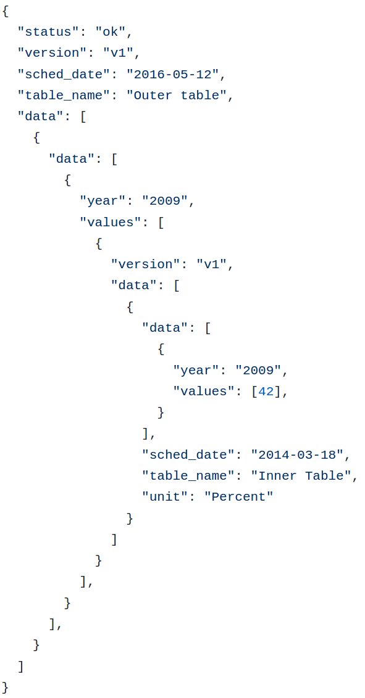
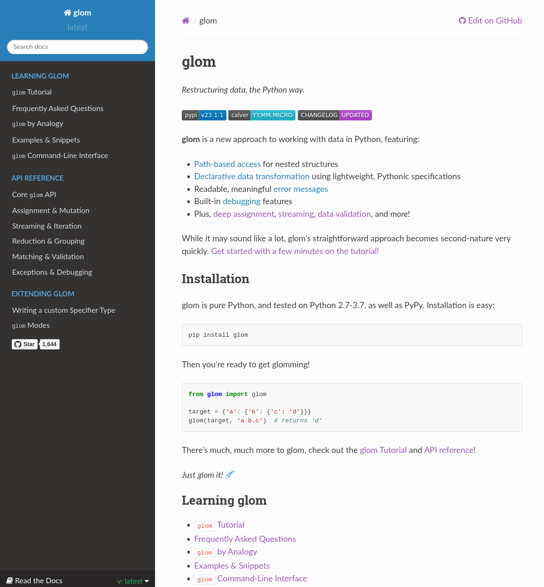
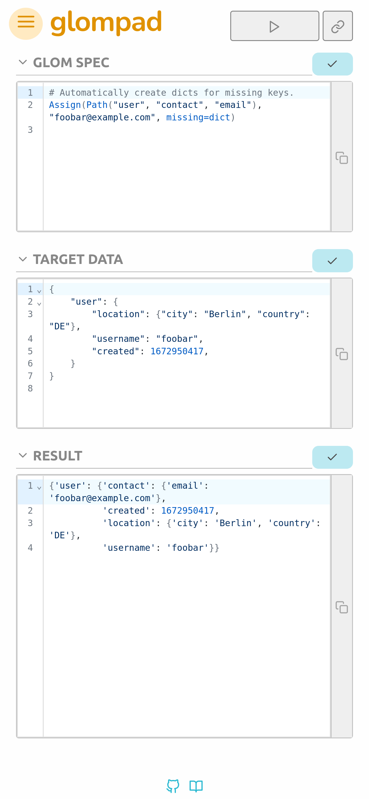
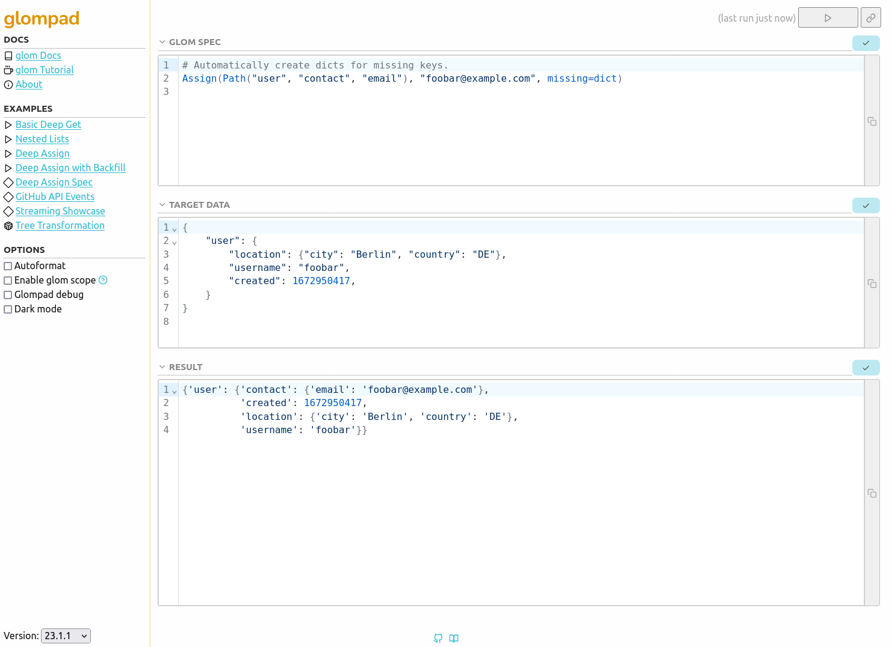
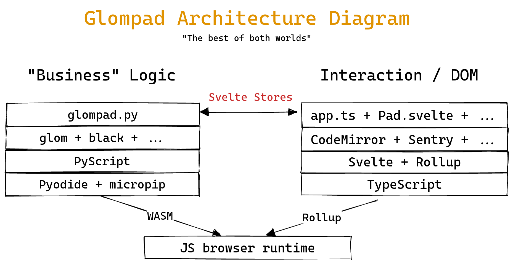
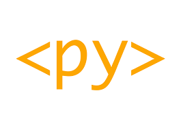
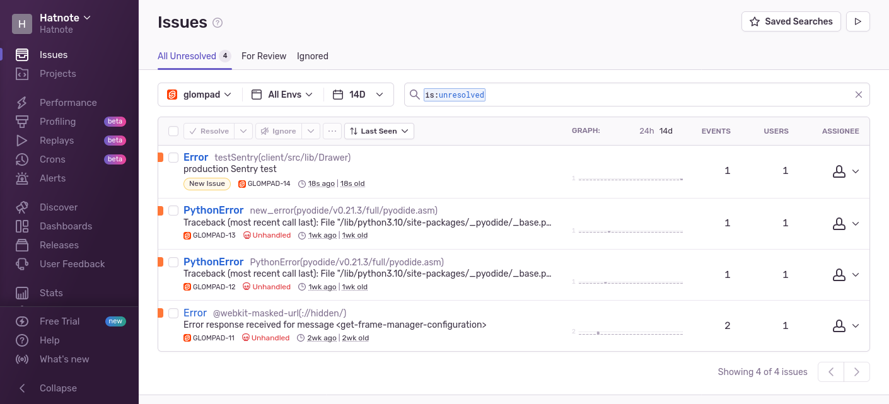
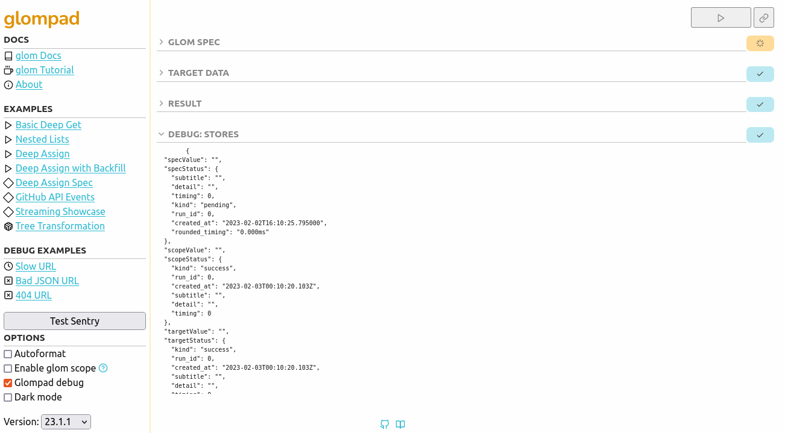
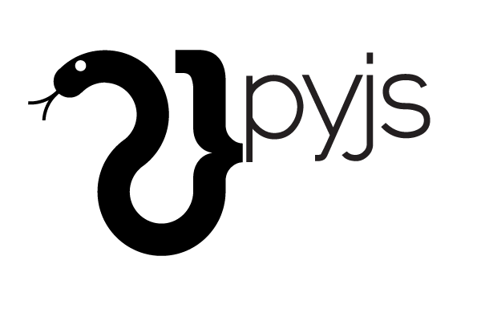
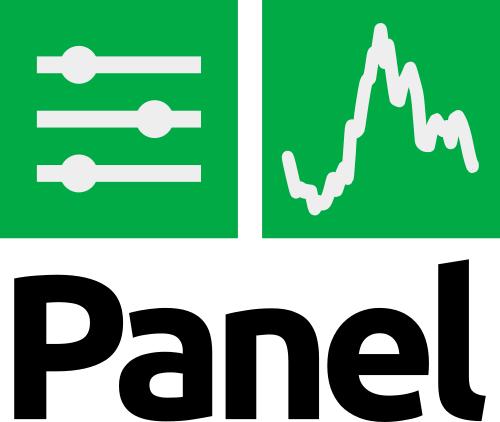

<div class="r-fit-text">
<h2>A Journey from </h2>
<h2>Back to Front</h2>
</div>

### Python in the Browser

<small>
Mahmoud Hashemi
| SF Python
| 2023-02-08
</small>
---

# Intro

* I'm Mahmoud
* Awesome Python Applications
* calver.org (and 0ver.org)
* boltons and other Python libraries
* On parental leave
* Working on something new


---
## Something completely different

* Started a project last year.
* Launched it... today!
* Here: https://yak.party/glompad

---
# Demo <!-- .element: class="r-fit-text"  -->
---

## PyScript demo

<div style="font-size: 20px !important; text-align: left;">
  <py-repl id="my-repl" output="demo-1-output">
  # this is definitely not JS/TS
  import sys
  list(sys.modules.keys())[:15]
  </py-repl>
  <div id="demo-1-output"></div>
</div>

Note: Audience Qs: Who knew this was possible? Who's done this before?

---
# Roadmap

1. Declarative data transformation
2. glom in a not-shell
3. Web history repeating itself?
4. Key takeaways

---
# Transforming data
---
## Real world data 

It doesn't fit on slides.


---

## Deep-get

Real data runs deep.

```python
>>> from boltons.iterutils import get_path
>>> root = {'a': {'b': {'c': [['d'], ['e'], ['f']]}}}
>>> get_path(root, ('a', 'b', 'c', 2, 0))
'f'
```

But why?

---

## Better errors

Which would you rather debug?

```python
>>> root = {'a': {'b': {'c': [['d'], ['e'], ['f']]}}}
>>> root['a']['b']['c'][2][1]
...
IndexError: list index out of range
```

Or:

```
PathAccessError: could not access 2 from path ('a', 'b', 'c', 2, 1), 
  got error: IndexError('list index out of range')
```

---
## That was 2015. 

We were just getting started.
---

---
## 2018: glom 0.1

Concept outgrew boltons.

```python
target = {'a': {'b': {'c': 'd'}}}
glom(target, 'a.b.c')
# 'd'
```

But deep-get was just the beginning.

---

## Beyond paths

Multi deep-get

```python
target = {'data': {'id': 2, 'date': '1999-01-01'}}

spec = {'id': 'data.id',
        'date': 'data.date'}

glom(target, spec)
```

Output:
```python
{'id': 2,
 'date': '1999-01-01'}

```
---

## Declarative data transformation

* Like templates. But for your data.
* Smaller, better code
* Fewer, better errors

---

## 2023: glom 23.1

So many new features

* Star paths
* Deep assignment / deletion
* Streaming
* Flattening
* Pattern matching / validation
* Errors 2.0


---
### Star paths

Wildcard selectors, both recursive and not.

```python
glom({'a': [{'k': 'v1'}, {'k': 'v2'}]}, 'a.*.k')  # * is single-level
# ['v1', 'v2']

glom({'a': [{'k': 'v3'}, {'k': 'v4'}]}, '**.k')  # ** is recursive
# ['v3', 'v4']
```

---
### Deep assignment

Not just for immutable transformation anymore!

```python
target = {'a': [{'b': 'c'}, {'d': None}]}
assign(target, 'a.1.d', 'e')  # let's give 'd' a value of 'e'
# {'a': [{'b': 'c'}, {'d': 'e'}]}
```

With autocreation/backfill:

```python
target = {}
assign(target, 'a.b.c', 'hi', missing=dict)
# {'a': {'b': {'c': 'hi'}}}
```

Also deep deletion.

```python
target = {'a': [{'b': 'c'}, {'d': None}]}
delete(target, 'a.0.b')
# {'a': [{}, {'d': None}]}
```

<!-- ^ TOO LONG -->
---
### Streaming

```python
target = [1, 2, None, None, 3, None, 3, None, 2, 4]

spec = Iter().filter().unique()  # this gives a streaming generator when evaluated
glom(target, spec.all())  # .all() converts the generator to a list
# [1, 2, 3, 4]
```

---
### Flattening and Merging

Combine mixed iterables with ease:

```python
list_of_iterables = [{0}, [1, 2, 3], (4, 5)]
flatten(list_of_iterables)
# [0, 1, 2, 3, 4, 5]
```

Also merge dictionaries:

```python
target = [{'a': 'alpha'}, {'b': 'B'}, {'a': 'A'}]
merge(target)
# {'a': 'A', 'b': 'B'}
```

---
### Pattern matching

Not just for transformation anymore! Also validation:

```python
# load some data
target = [{'id': 1, 'email': 'alice@example.com'}, 
          {'id': 2, 'email': 'bob@example.com'}]

# let's validate that the data has the types we expect
spec = Match([{'id': int, 'email': str}])

result = glom(target, spec)
# result here is equal to the data itself
```

---
### Even better errors

Add bad data:
```python
>>> target.append({"id": "3", "email": "charlie@example.com"})
```

Then: 
```
>>> result = glom(target, spec)
Traceback (most recent call last):
  File "<stdin>", line 1, in <module>
  File "../glom/core.py", line 2294, in glom
    raise err
glom.matching.TypeMatchError: error raised while processing, details below.
 Target-spec trace (most recent last):
 - Target: [{"email": "alice@example.com", "id": 1}, {"email": "bob@example.com", "id": 2}, (len=3)
 - Spec: Match([{"email": str, "id": int}])
 - Spec: [{"email": str, "id": int}]
 - Target: {"email": "charlie@example.com", "id": "3"}
 - Spec: {"email": str, "id": int}
 - Target: "id"
 - Spec: "id"
 - Target: "3"
 - Spec: int
glom.matching.TypeMatchError: expected type int, not str
```

---
### Errors: Before and After


---

## Docs



<a href="https://glom.rtfd.io">glom.rtfd.io</a>
---

## Embedded tutorial

Try in the REPL:

```python
from glom import tutorial
```

OR try it in the browser with repl.it

<iframe height="400px" width="100%" src="https://repl.it/@mhashemi/glom-basic-deep-get?lite=true" scrolling="no" frameborder="no" allowtransparency="true" allowfullscreen="true" sandbox="allow-forms allow-pointer-lock allow-popups allow-same-origin allow-scripts allow-modals"></iframe>

---

## Friction

* Learning curve
* Like regex
* Density and context switching

---
# glompad

A data transformation sandbox.

---
## Design

REPL -> Notebook

* Audience Qs: 
  * How many use notebooks daily? Weekly?
  * Python -> IPython -> IPyNb (Jupyter) -> Observable, Zeppelin, etc.

---
## Good company

<div style="display: flex; flex-wrap: wrap; flex: 1; height: 100%; align-items: center;">


</div>

---
# Features <!-- .element: class="r-fit-text"  -->
---

## Mobile first

<div style="display: flex; align-items: center; justify-content: space-evenly;">

<div>=</div>

</div>

---

## Other features

* Shareable URL
* Copy to clipboard
* Dark mode
  * P0 for a dev tool
* Optional black autoformatting
* Curated examples
---



---
# Highlights <!-- .element: class="r-fit-text"  -->
---
## It works!

<div style="display: flex; flex-wrap: wrap; flex: 1; height: 100%; justify-content: space-evenly;">




</div>

---
## More fun than React

<div style="display: flex; flex-direction: column; flex: 1; height: 100%; align-items: center; justify-content: space-evenly;">
<p>Development loop is tight.</p>


</div>

---

## Secure

* Full power of Python, no worry about compromising the backend

---

## Relatively stable

* This is the node ecosystem we're talking here.
* Three big upgrades over the course of three months, JS broke twice, Python once

---
# Protips <!-- .element: class="r-fit-text"  -->
---

## Build script

* Write your own, wrapping vite and rollup
* Will come in handy

---
## Sentry

Manual test, add Sentry, ship.



---
## Debug mode



Inspect page state, quickly test bad examples, and trigger sample errors.

---
# Lowlights <!-- .element: class="r-fit-text"  -->

From <em>"just OK"</em> to <em>"here be dragons."<em>

---
## Package support

* Only supports wheels
* If it's not pure Python, needs to target emscripten
* Anaconda backing this via PyScript is promising; math-related packages can be some of the hardest-to-build

---
## Playwright


* Easy to get started
* Slower than expected, esp with Firefox. 
  * Selenium might be faster based on open issues I found.

---
## Docs

* Pyodide docs are OK for reference
* PyScript docs have a good metastructure, but lots of gaps.

---
## JS <-> Python communication

* Everything gets wrapped in proxy objects
* Careful to unwrap and rewrap appropriately
* Glompad may have some memory leaks
  * Frontend standard practice

---
## Interrupts

Setting up interruptible execution is involved (Web Workers).

If you hit an infinite loop, refresh the page.

---
## PyScript

* PyScript was easy to get started
  * Using Pyodide directly is looking like the better investment if you care about control. 
  * PyScript feels like a bit of a demo vehicle.
  * Example: PyScript could make setting up a web worker easier: https://github.com/pyscript/pyscript/issues/808
* Annoyingly PyScript chose the exact same tools I did?
  * Svelte and CodeMirror power the REPL and other components. 
  * This led to some very confusing errors that I thought were coming from my bugs, but were actually PyScript breakages.

---
## Ugly: Misc JS

* Svelte stores are great, but a bit too basic. 
  * For debugging, I found myself missing Redux. 
  * There are a wide variety of alternative stores worth looking into.
* CodeMirror 6 is way more complex than earlier versions. 
  * Powerful, but hard to find examples that do exactly what you want. 
  * Probably worth it, but be ready.
* It's still frontend. 
  * You've got to be 2-3x as careful when you upgrade packages.

---
# Are we making progress?

Python in the browser over the years

Just for fun, let's see how far we've come.

---
## PyJS



2009-2015 (FKA Pyjamas)

Transpiles Python to JS.

Included Qt/GTK-style widgets.

---
## Silverlight


2010 - 2019/2021

IronPython

Died with IE11

---
## Skulpt


2009 - Today

Transpiler + runtime.

Still struggling to make the 2->3 jump (on 3.7 now)

Partial stdlib.

---
## Empythoned


2011-2012

Repl.it's emscripten CPython: https://github.com/replit-archive/empythoned

Same basic approach as Pyodide

---
## PyPy.js


2013 - 2019

Now points to Pyodide

---
## Brython


2014 - Today

Still updated, supports Python 3.11

Works via an autotranslation of CPython to JS, but not at the assembly level.

---
## Transcrypt

Active-ish transpiler (Python 3.9).

Like PyJS, Doesn't ship the whole interpreter.

Write Python compile to JS, ship that. No `eval()`.

Get Python syntax, but not the Python ecosystem. No `pip`.


https://pyreact.com/

See also: Rapydscript

---
# Worth it?

**Yes.**

Pyodide really *is* different from past iterations.

<ul class='checked-list'>
  <li>Python syntax</li> 
  <li>Python stdlib</li> 
  <li>Python ecosystem (pip)</li> 
  <li>DOM access</li> 
  <li>Bidirectional JS interaction</li> 
</ul>

---
# When/why should you try it?

* When page startup can take a little longer (SPA-style)
* When sandboxing/security is a primary concern
* When efficiency/high-perf is not a primary concern (graphics)
* When you want to use the numerical/scientific Python stack (and the rest of the ecosystem)

---
# Start <!-- .element: class="r-fit-text"  -->

---
## PyScript 


Easiest for a totally custom app like glompad.

http://pyscript.net

---
## JupyterLite 


There if you just want to say you ran Python in the browser.

https://jupyter.org/try-jupyter/lab/

Also good for docs: REPLite

https://github.com/jtpio/replite 

---
## Holoviz Panel



For dashboarding, visualization.

https://panel.holoviz.org/ 

---
## Holoviz Panel demo

<iframe src="https://portfolio-optimizer.pyviz.demo.anaconda.com" width="100%" style="height: 70vh;" frameborder="0" onload="this.parentNode.style.background = 'none'"></iframe>

---
# Keep in touch

* https://yak.party/glompad
* https://github.com/mahmoud
* https://twitter.com/mhashemi
* https://qoto.org/@mahmoud 

